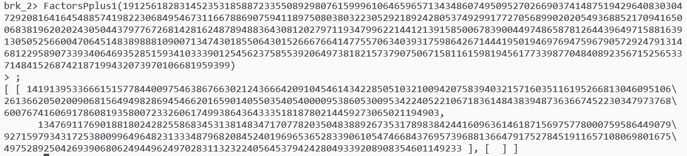

生成过程提示 $p+1$ 很光滑，直接先用 GAP 分解：



分解完发现 $e$ 不与 $p-1$ 互素，先把明文模 $q$ 的余数正常解出：

```python
cq = pow(cipher, pow(e, -1, q - 1), q)
```

模 $p$ 的情况下直接把所有的 $e$ 次方根抽取出来，枚举完了 CRT 即可：

```python
cp = F(cipher).nth_root(e, all=True)
q1 = int(pow(p, -1, q)) * p
p1 = int(pow(q, -1, p)) * q
for u in cp:
    m = (int(u) * int(p1) + int(cq) * int(q1)) % n
    if b'buaa' in long_to_bytes(m):
        print(long_to_bytes(m))
```

