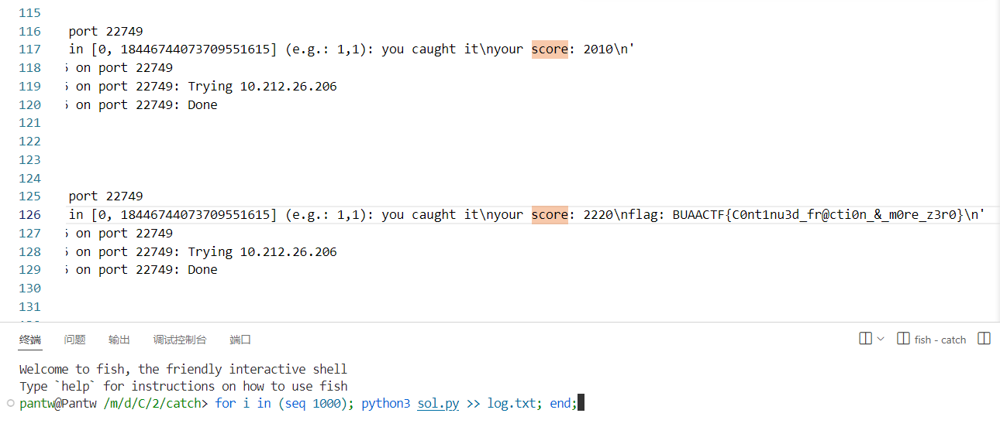

梳理逻辑，大概是一些乱七八糟的 `rand_range` 消耗随机数防止状态被解出，然后随机 $128$ 位的 $s$，要求构造 $0\le i, j<2^{64}$ 使得 $|si-2^{128}j|$ 的二进制中 $0$ 的数量尽量少，不足 128 位补至 128 位。

转化一下大概就是最小化

$$
\left|\cfrac{s}{2^{128}}-\cfrac{i}{j}\right|
$$

这显然是一个有理逼近的经典问题，直接连分数解决。但是连分数只能保证误差小，并不能保证 $0$ 的数量最多，所以需要加一点扰动和随机化调优，本地大概十几次能出一次。

```python
from pwn import *

def get_conv(p, q, ss, limit):
    ret = (1, 1)
    Min = 128
    arr = []
    while q:
        arr.append(p//q)
        p, q = q, p%q
    for i in range(len(arr)):
        u, v = 0, 1
        for s in reversed(arr[:i]):
            u, v = v, u + v * s
        if max(u, v) < limit:
            val = bin(abs(ss * v - u * 2**128)).count('1')
            if val < Min:
                Min = val
                ret = (u, v)
        else:
            break
    return ret


def solve(p, q, limit):
    uu, vv = get_conv(p, q, q, limit)
    for _ in range(128):
        u, v = get_conv(p, q+random.randint(-2**12,+2**12), q, limit)
        if bin(abs(q * vv - uu * p)).count('1') > bin(abs(q * v - u * p)).count('1'):
            uu, vv = u, v
    return uu, vv

# proc = process(['python3', 'task.py'])
proc = remote('10.212.26.206', 22749)
for i in range(256):
    proc.recvuntil(b'at [')
    u, v = map(int, str(proc.recvuntil(b']'))[2:-2].split(','))
    proc.sendline(b'D' * u + b'W' * v)
    proc.recvuntil(b'rand: ')
    s = int(proc.recvuntil(b'\n'))
    x, y = solve(2**128, s, 2**64)
    proc.sendline(bytes(f'{x},{y}', encoding='ASCII'))
print(proc.recvall())
```

