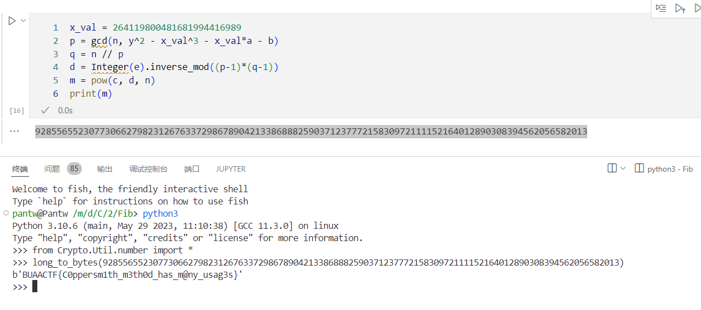

首先读题：

- 生成 512b 的素数 $p, q$
- 常规 RSA 加密 flag
- 生成 512b 的素数 $a, b$，作为曲线 $E$ 的参数
- 生成 78b 的素数 $x$
- 计算 $x$ 在 $E(\mathbb{F}_p)$ 上对应的点的 $y$ 坐标
- 给出 $e, n, c, a, b, y$

这个模型和下面这个题有点类似，RSA 问题不大，主要问题在后面部分。

后面部分其实就一个式子：

$$
x^3+ax+b\equiv y^2\pmod{p}
$$

虽然这里面 $x$ 未知，$p$ 也未知，但是 $x<2^{78}$ 这个还是一个比较强的约束，同时 $n$ 是 $p$ 的一个倍数，依然可以利用。

幸运的是，这是一个经典问题，是下面这个题研究的问题的一个简单版本，其弱化版即为 Coppersmith 攻击。

大概做法就是确定一个上限 $m$，然后想办法列出尽量多的模 $p^m$ 的方程，然后用 LLL 互相消，得到一个小系数的模 $p^m$ 的方程 $f(x)\equiv 0\pmod{p^m}$，如果 $x$ 的界使得 $|f(x)|\le p^m$，那么 $f(x)=0$ 在 $\mathbb{Z}$ 上也成立，直接分解即可得到 $x$。

LLL 消出来的向量的模的量级大概在 $2^{n/4}(\det\mathcal{L})^{1/n}$，其中 $n$ 是 $\mathcal{L}$ 的秩。

那么构造格的关键就是要让格的 $\det$ 小于所需的界，这时候 LLL 消出来的向量就可以用于后面的解方程环节。

还好 Coppersmith 原本的算法对于这个问题也适用，取 $m=16$ 时构造出的格满足要求，实现如下：

```python
ZN = IntegerModRing(n)
R.<xx> = PolynomialRing(ZZ)
beta = 1 / 2
delta = 3
def solve(m):
    X = 2**78
    qx = xx*X
    f = qx^3 + a*qx + b - y^2
    t = floor(delta * m * (1 / beta - 1))
    pls = []
    for i in range(m):
        for j in range(delta):
            pls.append(qx^j * n^(m-i) * f^i)
    for i in range(t):
        pls.append(qx^i * f^m)
    ll = m*delta+t
    L = [[int(u[i]) for i in range(ll)] for u in pls]
    return L
ret = solve(16)
```

sage 自带的 LLL 实在太慢，直接导出后用其他 LLL 库求，还可以发挥并行性：

```python
ss = '[' + ('\n'.join('[' + (' '.join(str(_) for _ in u)) + ']' for u in ret)) + ']'
with open('L.fplll.txt', 'wb') as f:
    f.write(bytes(ss, encoding='ASCII'))
```

L 完之后读入，重新构造出多项式，求出根来：

```python
text = ''
with open('L.O.fplll.txt', 'rb') as f:
    text = f.readline()
text = text[2:-2]
arr = list(map(int, text.split()))
arr = [arr[i] >> (i * 78) for i in range(len(arr))]
fpl = sum(arr[u]*xx^u for u in range(len(arr)))
fpl.roots()
# [(264119800481681994416989, 1)]
```

直接用这个跟 $n$ 求 $\gcd$ 即可：

