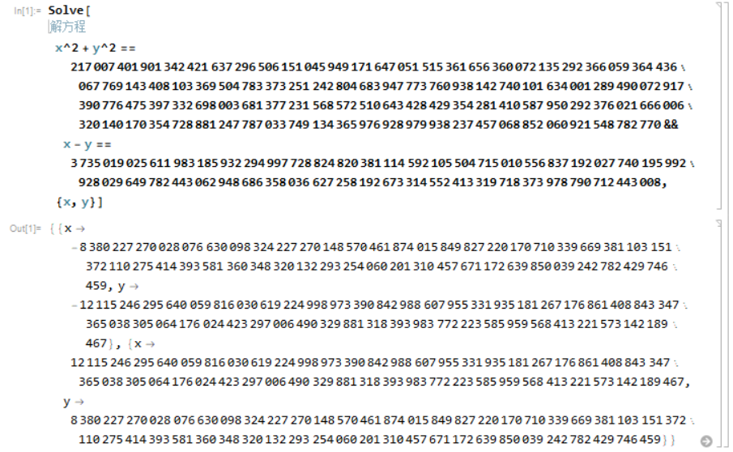

### Part 1

盲猜 $p-1,q-1$ 互素，则有：

$$
ed\bmod{(p-1)(q-1)}=1\implies ed_{p-1}=k(p-1)+1
$$

同时 $k\le e$，直接枚举 $k$ 尝试可能的 $p$ 即可：

```python
qwq = e * d - 1
p = 0
for i in range(1, e + 1):
    if qwq % i == 0:
        if gcd(qwq // i + 1, n) > 1:
            print(i, gcd(qwq // i + 1, n))
            p = gcd(qwq // i + 1, n)
            break
q = n // p
d = pow(e, -1, (p - 1) * (q - 1))
m = pow(c, d, n)
print(m)
# >>> long_to_bytes(22571959419410454275117314351778613899635)
# b'BUAACTF{Crypto_1s'
```

### Part 2

明显两个 gift 就是两个因子。

```python
# g1 == p^q mod pq = rp
# g2 == q^p mod pq = sq
# print(is_prime(gift1), is_prime(gift2))
# True True
e = 0x10001
d = pow(e, -1, (gift1 - 1) * (gift2 - 1))
n = gift1 * gift2
m = pow(c, d, n)
print(m)
# >>> long_to_bytes(494573836009974380615278007115736441)
# b'_@_long_journey'
```

### Part 3

第三段直接解下方程就得到 $p, q$，下略。



```python
d = pow(e, -1, (p-1) * (q-1))
m = pow(c, d, p * q)
print(m)
# 32424431590285906550434514628279905379891
# >>> long_to_bytes(32424431590285906550434514628279905379891)
# b'_In_your_CTF_Lif3'
```

### Part 4

最后一段直接用一个 Euler's Factorization 就出了：

```python
e = (a0^2 - a1^2) // (b1^2 - b0^2)
p, q = gcd(n, a0 * b1 - a1 * b0), n // gcd(n, a0 * b1 - a1 * b0)
d = pow(e, -1, (p-1)*(q-1))
m = pow(c, d, n)
print(m)
# >>> from Crypto.Util.number import *
# >>> long_to_bytes(126652764908552947544764870513545015933)
# b'_Hold_on_BUAAer}'
```