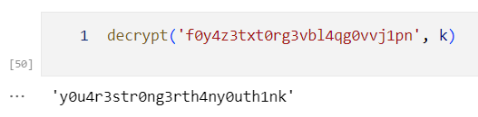

注意到

$$\sum_{i=0}^{n-1} {A}^{ik}=({E}-{A}^k)^{-1}({E}-{A}^{nk})$$

直接计算即可得到密钥。

```python
R = IntegerModRing(M)
A = matrix([[R(1), R(1)], [R(1), R(0)]])
E = matrix([[R(1), R(0)], [R(0), R(1)]])

def calc(n, ff):
    ret = A^n
    for i in ff:
        ret += (A^(n % i) - A^n) / (E - A^i)
    return ret

Ans = calc(m - 1, fac_list)
ans = Ans[0][0]

from hashlib import md5
k = md5(str(ans).encode()).hexdigest()
def all_alpha(str):
    msg = ""
    for i in str:
        if '0' <= i <= '9':
            msg += chr(ord(i) - ord('0') + ord('a'))
        else:
            msg += i
    return msg

k = all_alpha(k[6:])

def decrypt(flag, key):
    msg = ""
    j = 0
    while j < len(key):
        for i in flag:
            if 'a' <= i <= 'z':
                msg += chr((ord(i) + 26 - ord(key[j])) % 26 + ord('a'))
            else:
                msg += i
            j += 1
    return msg
```

