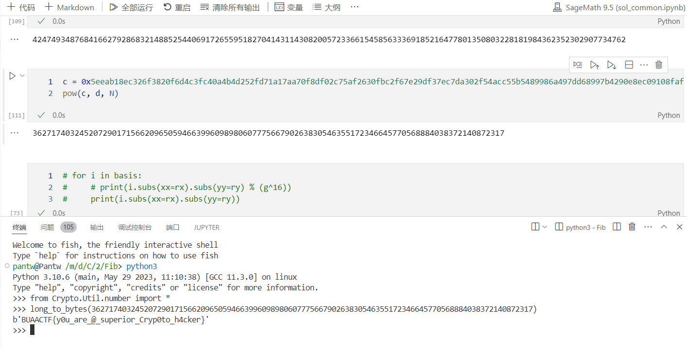

读了这个题的论文之后做上面那个题就很容易了，思路一下子就理解了；做完上面那个题之后再回来这个题，参数的选择和实验也成熟了不少，只能说这两个题的组合真是 educational 啊（

论文思路很明显，就是列出两个方程，其中 $x=d,y=p+q+1,E=e^{-1}\bmod{N-1}$：

$$
\begin{cases}
	E-x\equiv 0\pmod{g}\\
	N-y\equiv 0\pmod{g^2}
\end{cases}
$$

其中 $g\simeq N^{\gamma}, x\simeq N^{\beta}, y\simeq N^{1/2}$。

然后就可以用那个经典的思路，列尽可能多的方程，同时把 $x, y$ 的量级包含进去，相当于 $x'\coloneqq N^\beta x,y'\coloneqq N^{1/2}y$，然后 LLL 消完再倒回来。注意这里面需要试验一下参数，因为太小的格的 $(\det \mathcal{L})^{1/n}$ 约出来之后很难卡进界里。经过实验发现格大小为 196 时可以解出。格构造部分实现如下：

```python
N = 0x5c8a8f1a91bc985ea43564d74adb7571d188f5a4564400fe7303b8b1e108f155fea541f255a3d3b22610ed31de7cd8e01199cd3364572a554704eb1427c651efd4899a1567dab720092b3a731634f03fa312fe97b37c4437381dec2ad4352c7ba2f4b8073e6d6e8242baae119df5ba8bd30ed17a0cfc520e2b4ec33d67
e = 0xe17fe8d3a6025922083a12ed11f3acb03e2887e6507f35f397b5c10afb9b39cec8fc0201bfc6e7f0d96372655f9b17fa400ab441a383905cf5dbb87fabdec02a0c1c8bc9ddd5b3cd

gamma = 0.42
beta = 0.25
half = 0.5
ZN = IntegerModRing(N)
R.<xx, yy> = PolynomialRing(ZZ)

def solve(t):
    X = 2^256
    Y = 2^512
    # ---- primitive equations
    N1 = N - 1              # = 2gh
    ie = int(pow(e, -1, N1))
    # ed - 1 == 0 mod g
    # ie == d mod g
    # -ie + d == 0 mod g
    # eq1 = R(-ie + xx)
    eq1 = R(-ie + xx*X)
    # N = pq = (2ga+1)(2gb+1) = 4ab g^2 + 2ga + 2gb + 2 - 1
    # yy := p + q - 1
    # N - yy == 0 mod g^2
    # eq2 = R(-N + yy)
    eq2 = R(-N + yy*Y)
    gr = []
    pp = []
    for i in range(int(t/beta + 2)):
        for j in range(int(t/half + 2)):
            if beta * i + half * j <= gamma * t:
                pl = eq1 ** i * eq2 ** j * N1 ** max(0, t - i - j - j)
                gr.append((i+j, i, pl))
                pp.append((i+j,i))
    gr = list(sorted(gr))
    pp = list(sorted(pp))
    # for ij, i, b in gr:
    #     assert b.subs(xx=rx).subs(yy=ry) % (g^t) == 0
    n = len(pp)
    L = matrix([list(map(lambda ij: u[R(xx**ij[1]*yy**(ij[0]-ij[1]))], pp)) for ijh, ih, u in gr])
    return L, pp
    # ll = L.LLL()
    # basis = [sum(map(lambda i: R(xx**pp[i][1]*yy**(pp[i][0]-pp[i][1])) * u[i], range(n))) for u in ll]
    # # return basis
    # for b in basis:
    #     assert b.subs(xx=rx).subs(yy=ry) % (g^t) == 0
    # # return basis
    # I = R.ideal(basis)
    # Ir = I.groebner_basis()
    # return Ir
```

调用 LLL 并重构多项式：

```python
M, pp = solve(16)
ss = '[' + ('\n'.join('[' + (' '.join(str(_) for _ in u)) + ']' for u in M)) + ']'
with open('M.fplll.txt', 'wb') as f:
    f.write(bytes(ss, encoding='ASCII'))

// call native LLL

text = []
with open('M.O.fplll.txt', 'rb') as f:
    text = [l.split() for l in f.readlines()]
text = text[:rank(M)]
text = [[int(str(x, encoding='ASCII').replace('[', '').replace(']', '')) for x in u] for u in text]
print([log(sum(map(lambda x:x^2, tx))**0.5)/log(2.0) for tx in text])
print(log(N^(gamma*16)/sqrt(rank(M)))/log(2.0))
basis = [sum(map(lambda i: R(xx**pp[i][1]*yy**(pp[i][0]-pp[i][1])) * (u[i] >> (pp[i][1]*256 + (pp[i][0]-pp[i][1])*512)), range(len(pp)))) for u in text]
```

论文中原本使用了 Groebner 基方法在二元多项式环中构造对应理想的约化基，从而获得较简的多项式以求根。实验发现 sage 中这一算法的实现的内存占用非常之高，同时性能也不好，在 81x81 的格的时候已经把系统撑爆死机了，只能另寻他法求根：

```python
Rd = basis[0].resultant(basis[1], yy)
RR.<ww> = PolynomialRing(ZZ)
Rd.degree()
Rw = sum(ZZ(Rd[xx^i])*ww^i for i in range(Rd.degree()+1))
Rw.roots()
# [(1572280599362391593435725400258745570939650041993215812531650889904563731673, 1)]
d = 1572280599362391593435725400258745570939650041993215812531650889904563731673
gcd(e*d-1, N-1)
# 42474934876841...302907734762
```

解出根之后正常 RSA 解密即可：

