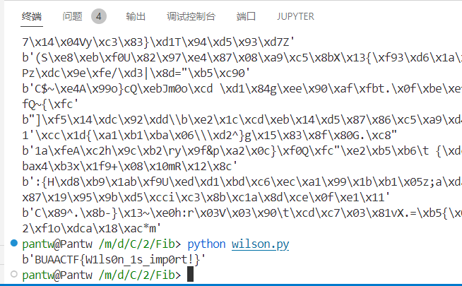

$q$ 太小了，直接暴力分解出 $p, q$，然后直接用 Wilson 定理解出模 $p$ 下的余数，枚举模 $q$ 的余数，CRT 出明文即可，大概长这样：

```python
assert n == p*q
qwq = 1
for i in range(p-q, p):
    qwq = qwq * i % p
mp = p - m * qwq % p
p1 = inverse(q, p) * q % n
q1 = inverse(p, q) * p % n
for i in range(q):
    s = long_to_bytes((p1 * mp + q1 * i) % n)
    if b'BUAACTF{' in s:
        print(s)
```

