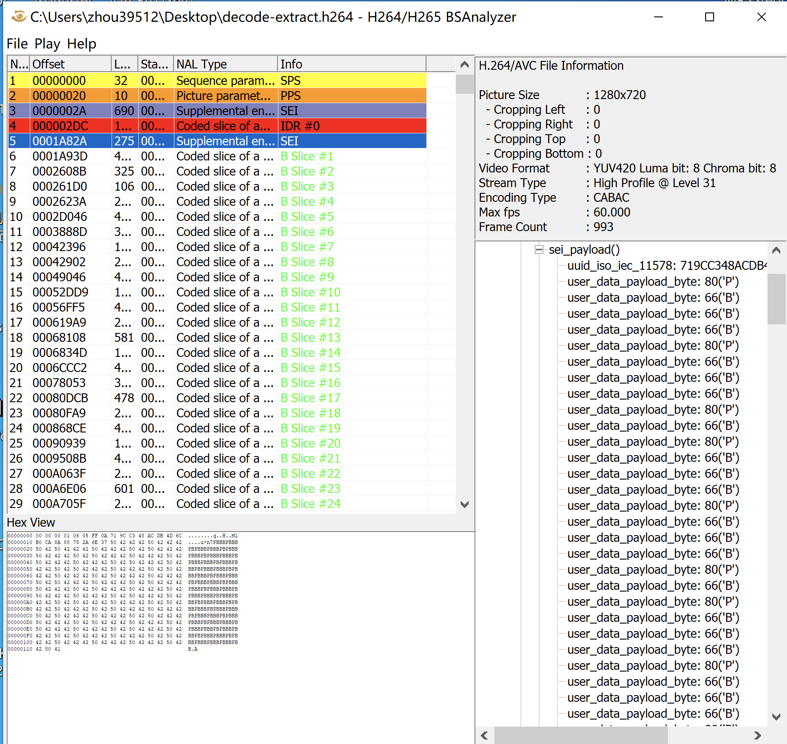
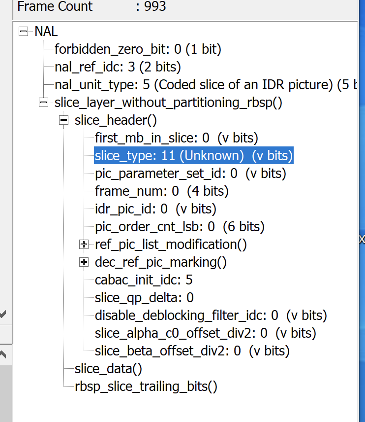
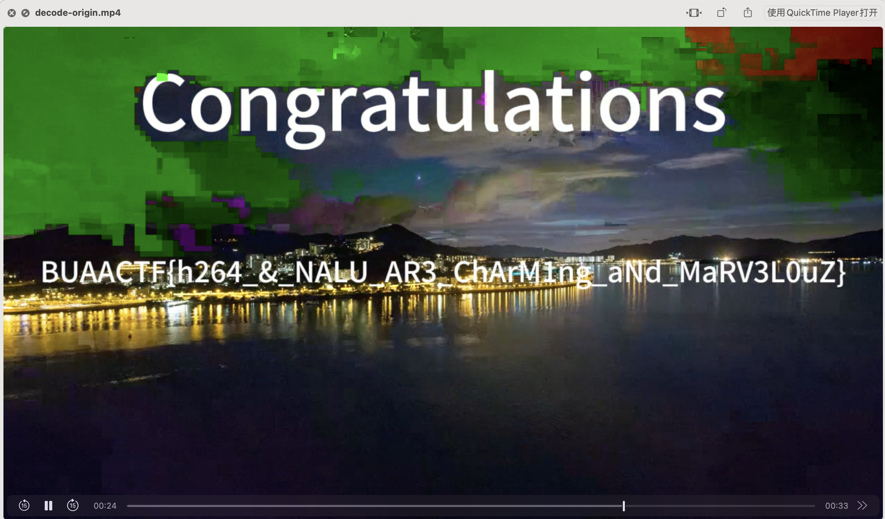

打开流量，导出特定分组，选择rtmp的导出保存rtmp.pcapng

使用tcpflow

```Python
tcpflow -T %T_%A%C%c.rtmp -r rtmp.pcapng
```

保存为为rtmp流

使用rtmp2flv

```Python
python ./rtmp2flv.py 2024-04-11T12/41/57Z_127.000.000.001.rtmp
```

导出一个不可见的flv

提取裸流
~~~
ffmpeg -i extract.flv -vcode copy extract.h264 
~~~

用H264BSanalyzer查看

发现视频帧全部被改成了B帧，而且在每个IDR关键帧下面，都有一个SEI帧，储存了PB的顺序，说明要恢复PB帧。

同时所有IDR关键帧的`slice_type`都被改成了11



正常来说，所有IDR帧都应该是I帧，所以要将所有IDR帧的slice_type改回来

~~~
import os

from h26x_extractor.h26x_parser import H26xParser
from uuid import uuid4

SLICE_TYPES = {0: 'P', 1: 'B', 2: 'I', 3: 'SP', 4: 'SI'}
EXTRACT_VIDEO = 'final/extract.flv'
ORIGIN_H264 = 'decode-extract.h264'
OUTPUT_H264 = 'decode-origin.h264'
OUTPUT_MP4 = 'decode-origin.mp4'


class BitStream:
    def __init__(self, buf):
        self.buffer = buf
        self.bit_pos = 0
        self.byte_pos = 0

    def ue(self):
        count = 0
        while self.u(1) == 0:
            count += 1
        res = ((1 << count) | self.u(count)) - 1
        return res

    def u1(self):
        self.bit_pos += 1
        res = self.buffer[self.byte_pos] >> (8 - self.bit_pos) & 0x01
        if self.bit_pos == 8:
            self.byte_pos += 1
            self.bit_pos = 0
        return res

    def u(self, n: int):
        res = 0
        for i in range(n):
            res <<= 1
            res |= self.u1()
        return res


def extract_slice_type(nalu_body):
    body = BitStream(nalu_body)
    #print(nalu_body[:3])
    first_mb_in_slice = body.ue()
    slice_type = body.ue()
    return slice_type


def read_sei(nalu_body):
    payload_type = nalu_body[0]
    payload_size = 0
    i = 1
    while nalu_body[i] == 0xff:
        payload_size+=255
        i+=1
    payload_size += nalu_body[i]
    return [chr(i) for i in nalu_body[i+1+16:i+1+payload_size]]


if __name__ == '__main__':
    os.system(f'ffmpeg -i {EXTRACT_VIDEO} -vcodec copy {ORIGIN_H264}')
    f = open(ORIGIN_H264, 'rb')
    origin_data = list(f.read())
    f.close()
    # 进行解密
    H26xParser = H26xParser(ORIGIN_H264, verbose=False)
    H26xParser.parse()
    nalu_list = H26xParser.nalu_pos
    data = H26xParser.byte_stream
    origin_slice_type_list = []
    prev_unit_type = 0
    count=0
    for tu in nalu_list:
        start, end, _, _, _, _ = tu
        rbsp = bytes(H26xParser.getRSBP(start, end))
        nalu_header = rbsp[0]
        nal_unit_type = nalu_header & 0x1F
        nalu_body = rbsp[1:]
        if nal_unit_type == 1:  #修改slice
            if origin_slice_type_list[count]=='P':
                origin_data[start + 1] = origin_data[start + 1] ^ 0x4
        elif nal_unit_type == 5:
            origin_data[start + 1] = origin_data[start + 1] ^ 0x4
        elif nal_unit_type == 6 and prev_unit_type == 5:
            count=0
            print(read_sei(nalu_body))
            origin_slice_type_list = read_sei(nalu_body)
        prev_unit_type = nal_unit_type
    new_data = bytes(origin_data)
    # 输出
    f = open(OUTPUT_H264, 'wb')
    f.write(bytes(new_data))
    f.close()
    # 封装
    os.system(f"ffmpeg -i {OUTPUT_H264} -vcodec copy {OUTPUT_MP4}")

~~~

封装后得到可以播放的视频

~~~
BUAACTF{h264_&_NALU_AR3_ChArM1ng_aNd_MaRV3L0uZ}
~~~