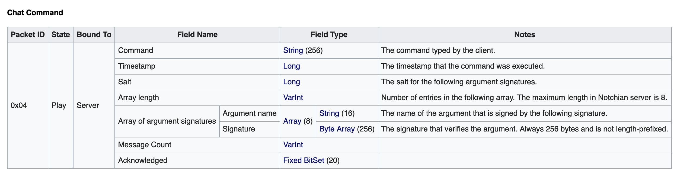
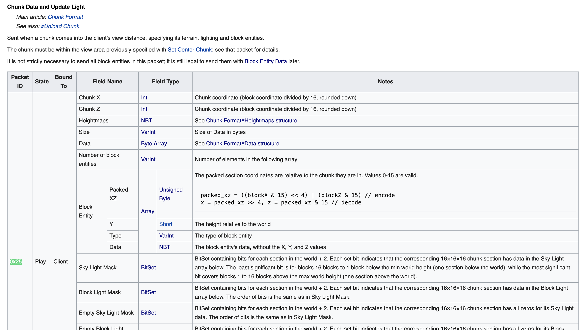

本题考查的是minecraft联机协议分析。

官方协议文档：https://wiki.vg/Protocol

本题的前一半是需要进行中间人攻击。虽然说是中间人攻击，但由于离线模式下的流量是未经加密的，所以其实只需要建立一个转发服务器，捕获流量，然后按照协议解包就行。（出题的本意是中间人攻击，可惜离线模式无法开启加密）

虽然是明文流量，但是服务器默认开启流量压缩，所以还是要读协议文档的`PacketFormat`部分，把流量解压缩。


解包之后还要对包进行筛选，对其内容进行解析。

由于登录是使用指令登录的，所以找到`Chat Command`包，通过其`PacketID`筛选包，然后对应解析。


如果流量转发没有问题，机器人能够正常登录服务器，就可以捕获到`/l xiaoj20240418`的登录命令。

获取密码之后登录服务器（服务器版本同样可以通过流量得到，不再赘述），能得到第二部分flag。
~~~
&M1N3CR4FT_1N_tH3_M1dDl3
~~~
后一半的flag被藏在了基岩下。由于是冒险模式，无法破坏方块，所以只能通过分析流量来获得。


虽然告示牌被藏在了基岩下面，但区块数据已经传到客户端，所以还是要分析流量。

完成这部分题目的最低限度就是找到区块加载的`PacketID`，为`0x25`，虽然文字作为实体是通过NBT格式传输的，但是NBT格式本身也是明文，所以直接看流量包数据就可以找到flag（需要一点耐心）。

期望的解法是按照协议解析`PacketID`为`0x25`的数据包，然后读取里面的实体信息。



注意这里解析的时候有一点坑，有时候会碰到`size`和`data`不对应的情况导致错误，目前这个bug（ https://bugs.mojang.com/browse/MC-131684, https://bugs.mojang.com/browse/MC-247438 ）似乎还没修复，出题人也没有什么好的办法，不过不影响做题，因为测试过告示牌文字的数据包是一定能正常解析的。

所以可能需要过滤一下，只解析告示牌文字的数据包。可以用前一半flag来定位包，因为文字实体都是在一个包里发送的。

**github地址** 是出题人用python实现了一个简单的客户端和服务器，模拟中间人攻击，实现了简单的流量包解析，可以自己试试。

内网穿透（或者直接跑在服务器上），设置好真实服务器地址，把虚假服务器地址发给机器人，机器人就会通过中间服务器访问到真实服务器，发送登录指令后就可以获取密码，通过解包得到后一半flag（其实前一半也可以直接解包）。

```
[+] SERVER Listening: 8888
[+] CLIENT Connect to: ('120.53.232.198', 25565)
[+] CLIENT Send: b'\x15\x00\xfd\x05\x0e120.53.232.198c\xdd\x01'
[+] CLIENT Send: b'\x01\x00'
[+] CLIENT Received: {'compressed': False, 'packet_length': 119, 'packet_id': '0x0'}
[+] CLIENT server_info {'version': {'name': 'Paper 1.20.4', 'protocol': 765}, 'description': 'A Minecraft Server', 'players': {'max': 20, 'online': 0}}
[+] CLIENT Connect to: ('120.53.232.198', 25565)
[+] CLIENT Send: b'\x15\x00\xfd\x05\x0e120.53.232.198c\xdd\x02'
[+] CLIENT Send: b'\x19\x00\x07xiaoJ_0\\\x13!\xe8\x03\xdbMm\xb4Ek\x86S\x81\xf2\x19'
[+] CLIENT Received: {'compressed': False, 'packet_length': 3, 'packet_id': '0x3'}
[+] CLIENT Received: {'compressed': True, 'packet_length': 27, 'packet_id': '0x2'}
[+] CLIENT Send: b'\x02\x00\x03'
[+] CLIENT Succsessfully Login to ('120.53.232.198', 25565)
[+] SERVER Connected from: ('127.0.0.1', 63443)
[+] SERVER Send: b'\x8f\x01\x00\x8c\x01{"version":{"name":"Spigot 1.20.4","protocol":765},"description":{"text":"","extra":["A Minecraft Server"]},"players":{"max":20,"online":0}}'
[+] SERVER Connected from: ('127.0.0.1', 63445)
[+] SERVER User {'Name': 'xiaoJ_0', 'PlayerUUID': b'\x13\x9dw\xf2\xfb\xb0J\xb6\xbb\xc5\xe3\xb0\xf5\xbc\x99w'} Successfully Login
[+] CLIENT [{'PackedXZ': 8, 'Y': -60, 'Type': 7, 'Data': <NBTFile with TAG_Compound('') at 0x107ff12e0>}, {'PackedXZ': 24, 'Y': -60, 'Type': 7, 'Data': <NBTFile with TAG_Compound('') at 0x107ff1520>}, {'PackedXZ': 11, 'Y': -60, 'Type': 7, 'Data': <NBTFile with TAG_Compound('') at 0x107ff32b0>}, {'PackedXZ': 27, 'Y': -60, 'Type': 7, 'Data': <NBTFile with TAG_Compound('') at 0x107ff36d0>}, {'PackedXZ': 14, 'Y': -60, 'Type': 7, 'Data': <NBTFile with TAG_Compound('') at 0x107ff7280>}, {'PackedXZ': 30, 'Y': -60, 'Type': 7, 'Data': <NBTFile with TAG_Compound('') at 0x107ff7640>}, {'PackedXZ': 14, 'Y': -62, 'Type': 7, 'Data': <NBTFile with TAG_Compound('') at 0x107fff280>}]
[+] CLIENT NBTFile: {3 Entries}
{
	TAG_Compound('front_text'): {3 Entries}
	{
		TAG_Byte('has_glowing_text'): 0
		TAG_String('color'): black
		TAG_List('messages'): [4 TAG_String(s)]
		{
			TAG_String: "小J的登录密码"
			TAG_String: ""
			TAG_String: ""
			TAG_String: ""
		}
	}
	TAG_Byte('is_waxed'): 0
	TAG_Compound('back_text'): {3 Entries}
	{
		TAG_Byte('has_glowing_text'): 0
		TAG_String('color'): black
		TAG_List('messages'): [4 TAG_String(s)]
		{
			TAG_String: ""
			TAG_String: ""
			TAG_String: ""
			TAG_String: ""
		}
	}
}
[+] CLIENT NBTFile: {3 Entries}
{
	TAG_Compound('front_text'): {3 Entries}
	{
		TAG_Byte('has_glowing_text'): 0
		TAG_String('color'): black
		TAG_List('messages'): [4 TAG_String(s)]
		{
			TAG_String: "part1"
			TAG_String: ""
			TAG_String: ""
			TAG_String: ""
		}
	}
	TAG_Byte('is_waxed'): 0
	TAG_Compound('back_text'): {3 Entries}
	{
		TAG_Byte('has_glowing_text'): 0
		TAG_String('color'): black
		TAG_List('messages'): [4 TAG_String(s)]
		{
			TAG_String: ""
			TAG_String: ""
			TAG_String: ""
			TAG_String: ""
		}
	}
}
[+] CLIENT NBTFile: {3 Entries}
{
	TAG_Compound('front_text'): {3 Entries}
	{
		TAG_Byte('has_glowing_text'): 0
		TAG_String('color'): black
		TAG_List('messages'): [4 TAG_String(s)]
		{
			TAG_String: "&M1N3CR4FT_1N"
			TAG_String: "_tH3_M1dDl3"
			TAG_String: ""
			TAG_String: ""
		}
	}
	TAG_Byte('is_waxed'): 0
	TAG_Compound('back_text'): {3 Entries}
	{
		TAG_Byte('has_glowing_text'): 0
		TAG_String('color'): black
		TAG_List('messages'): [4 TAG_String(s)]
		{
			TAG_String: ""
			TAG_String: ""
			TAG_String: ""
			TAG_String: ""
		}
	}
}
[+] CLIENT NBTFile: {3 Entries}
{
	TAG_Compound('front_text'): {3 Entries}
	{
		TAG_Byte('has_glowing_text'): 0
		TAG_String('color'): black
		TAG_List('messages'): [4 TAG_String(s)]
		{
			TAG_String: "part2"
			TAG_String: ""
			TAG_String: ""
			TAG_String: ""
		}
	}
	TAG_Byte('is_waxed'): 0
	TAG_Compound('back_text'): {3 Entries}
	{
		TAG_Byte('has_glowing_text'): 0
		TAG_String('color'): black
		TAG_List('messages'): [4 TAG_String(s)]
		{
			TAG_String: ""
			TAG_String: ""
			TAG_String: ""
			TAG_String: ""
		}
	}
}
[+] CLIENT NBTFile: {3 Entries}
{
	TAG_Compound('front_text'): {3 Entries}
	{
		TAG_Byte('has_glowing_text'): 0
		TAG_String('color'): black
		TAG_List('messages'): [4 TAG_String(s)]
		{
			TAG_String: "还有一半藏在下面哦"
			TAG_String: ""
			TAG_String: ""
			TAG_String: ""
		}
	}
	TAG_Byte('is_waxed'): 0
	TAG_Compound('back_text'): {3 Entries}
	{
		TAG_Byte('has_glowing_text'): 0
		TAG_String('color'): black
		TAG_List('messages'): [4 TAG_String(s)]
		{
			TAG_String: ""
			TAG_String: ""
			TAG_String: ""
			TAG_String: ""
		}
	}
}
[+] CLIENT NBTFile: {3 Entries}
{
	TAG_Compound('front_text'): {3 Entries}
	{
		TAG_Byte('has_glowing_text'): 0
		TAG_String('color'): black
		TAG_List('messages'): [4 TAG_String(s)]
		{
			TAG_String: "part3"
			TAG_String: ""
			TAG_String: ""
			TAG_String: ""
		}
	}
	TAG_Byte('is_waxed'): 0
	TAG_Compound('back_text'): {3 Entries}
	{
		TAG_Byte('has_glowing_text'): 0
		TAG_String('color'): black
		TAG_List('messages'): [4 TAG_String(s)]
		{
			TAG_String: ""
			TAG_String: ""
			TAG_String: ""
			TAG_String: ""
		}
	}
}
[+] CLIENT NBTFile: {3 Entries}
{
	TAG_Compound('front_text'): {3 Entries}
	{
		TAG_Byte('has_glowing_text'): 0
		TAG_String('color'): black
		TAG_List('messages'): [4 TAG_String(s)]
		{
			TAG_String: "&fL49_uNd3r_"
			TAG_String: "tH3_Gr455}"
			TAG_String: ""
			TAG_String: ""
		}
	}
	TAG_Byte('is_waxed'): 0
	TAG_Compound('back_text'): {3 Entries}
	{
		TAG_Byte('has_glowing_text'): 0
		TAG_String('color'): black
		TAG_List('messages'): [4 TAG_String(s)]
		{
			TAG_String: ""
			TAG_String: ""
			TAG_String: ""
			TAG_String: ""
		}
	}
}
[+] SERVER Received: {'compressed': False, 'packet_length': 27, 'packet_id': 4, 'packet_by_fields': {'Command': 'help', 'Timestamp': 1713586264225, 'Salt': 0, 'ArrayLength': 0, 'ArrayOfArgumentSignatures': [], 'MessageCount': 0, 'Acknowledged': '00000000000000000000'}}
[+] SERVER Received: {'compressed': False, 'packet_length': 38, 'packet_id': 4, 'packet_by_fields': {'Command': 'l xiaoj20240418', 'Timestamp': 1713586265230, 'Salt': 0, 'ArrayLength': 0, 'ArrayOfArgumentSignatures': [], 'MessageCount': 0, 'Acknowledged': '00000000000000000000'}}
[+] SERVER 断开与客户端的连接
[+] CLIENT 断开与服务器的连接

进程已结束，退出代码为 0
```

~~~
BUAACTF{xiaoj20240418&M1N3CR4FT_1N_tH3_M1dDl3&fL49_uNd3r_tH3_Gr455}
~~~