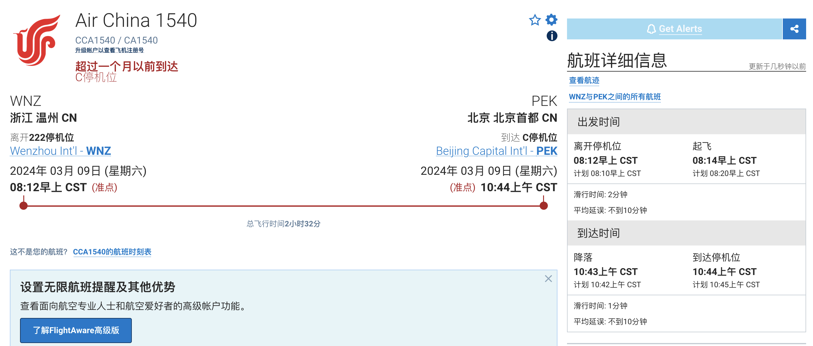

首先通过图片exif信息，可以知道拍摄时间为2024/03/09早上7:48。

通过观察图片，可以看到安全须知，得知是A33X机型。而且通过搜索可以知道这是国航的安全须知。

在[flightaware](https://www.flightaware.com/live/findflight/)中分别搜索温州到大兴和温州到首都的航班。限定了机型为A33X之后，发现只有温州到首都机场有两个航班。

分别看这两个航班的历史航班，查询03/09，发现CA1543当天的航班是取消的。

于是可以确定是CA1540航班.

这样我们只剩下座位号了，可以去[seatguru](https://www.seatguru.com/airlines/Air_China)查询座位分布图，机型为A330-300也就是A333。根据图片可以找到座位号为35A。

于是最后的答案为
~~~
CA1540_A333_35A_PEK_10:44
~~~
md5后得到flag
~~~
BUAACTF{ef1be763ade5883cf4446056a2aa1368}
~~~