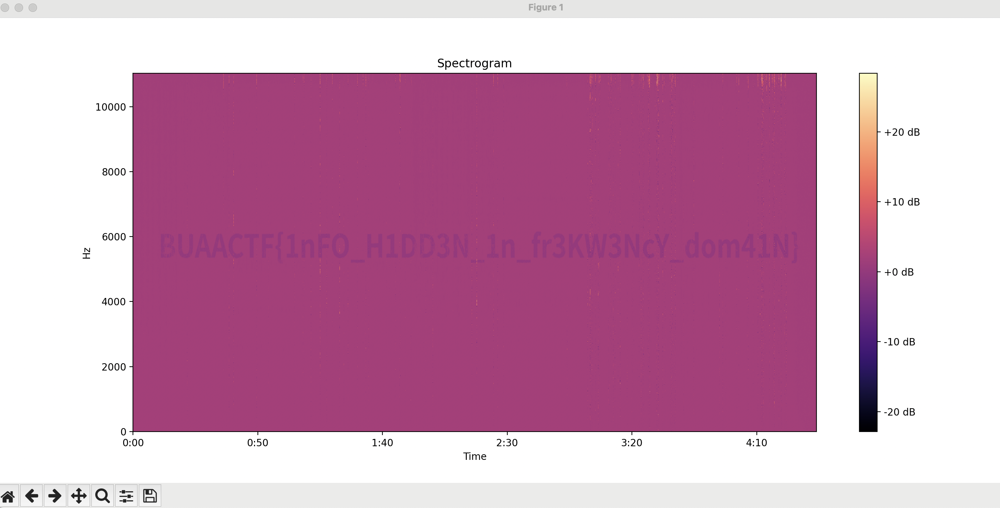

根据题目提示，是音频频域隐写。由于音频频域和时域转换是有损的，所以不可能使用二进制操作比如异或、与等方式进行隐写，可能的隐写方式只有加减。

于是对两个音频的频域数据做差。

使用`librosa`库对音频做STFT，提取到频域数据后做差，然后画频谱图即可看见flag。

~~~
import librosa
import librosa.display
import matplotlib.pyplot as plt

ORIGIN_FILE = "origin.wav"
ENCODED_FILE = "output.wav"

y, sr = librosa.load(ORIGIN_FILE)
S = librosa.stft(y)
spectrogram = librosa.amplitude_to_db(abs(S)) # 提取幅度并转换为DB

y, sr = librosa.load(ENCODED_FILE)
S = librosa.stft(y)
spectrogram2 = librosa.amplitude_to_db(abs(S)) # 提取幅度并转换为DB

for i in range(S.shape[0]):
    for j in range(S.shape[1]):
        spectrogram2[i, j] = spectrogram2[i, j] - spectrogram[i, j] # 做差

# 可视化频谱图
librosa.display.specshow(spectrogram2, sr=sr, x_axis='time', y_axis='linear')
plt.colorbar(format='%+2.0f dB')
plt.title('Spectrogram')
plt.show()
~~~

~~~
BUAACTF{1nFO_H1DD3N_1n_fr3KW3NcY_dom41N}
~~~
