# 是CTFer就坚持15s-Writeup

首先需要关注的就是MainWindow对象，游戏主要逻辑都是在这里实现的。有很多的方法，无从下手。

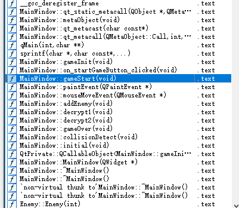

如果稍微懂一点C++的知识就可以找到MainWindow对象的构造函数与析构函数。

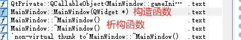

自然从构造函数下手。

构造函数里可以看到很多的常量，显然这是在设置些什么。

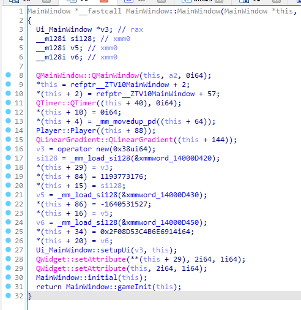

其中的14000D450比较可疑，里面的内容是0x12345678之类的。

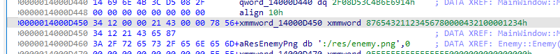

刚刚这个奇怪的常量存到了对象的+20位置，可以记一下。先按下不表，不过大概率这里就是密文和密钥存在的地方了。

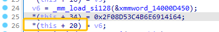

我们还可以看到两个解密函数

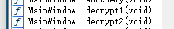

两个解密函数本身是比较好逆向的，魔改的TEA和XTEA，主要是要找到调用的地方。

通过交叉引用，会发现两个函数都在一个奇怪的函数中被调用了

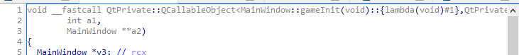

这个函数名称上有一个`gameInit`，于是我们可以先去`gameInit`函数看看。

在`gameInit`中我们可以看到这个奇怪的函数被存到了`v5+8`的位置，然后v5又被传入了一个connectImpl函数中

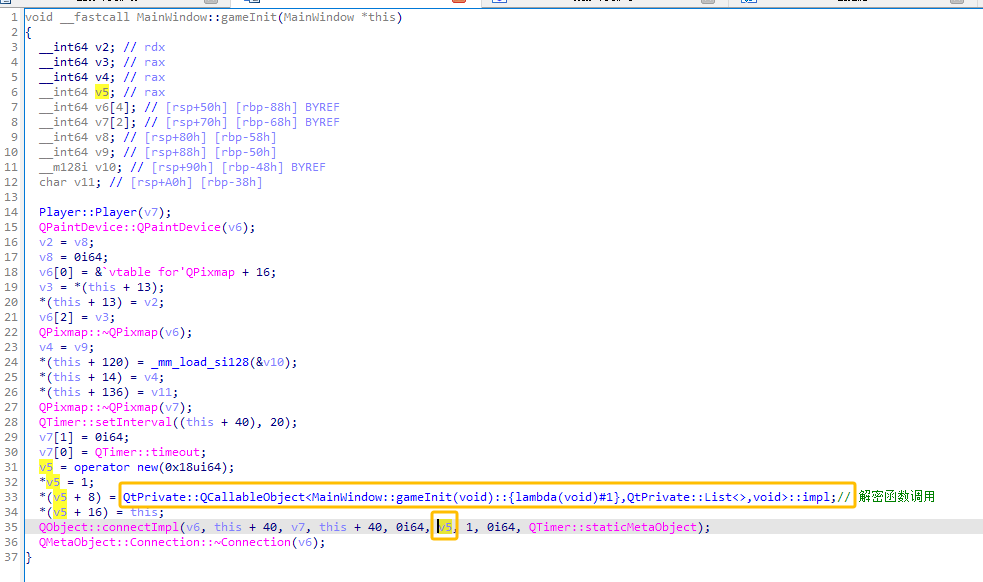

通过搜索QT`connectImpl`，可以找到很多的分析文章。

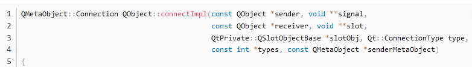

找到`connectImpl`的源码，这第6个参数是一个`QSlotObjectBase`，此对象包装了槽函数地址。槽函数类似于回调函数，在某个信号被发出时就会调用。所以这个奇怪的函数和某个信号进行了绑定。

可以看到最后一个参数是一个`QMetaObject`，参数名为`senderMetaObject`，不难猜测，这里的`senderMetaObject`指的就是信号发送的对象元类型。

回到IDA中，可以看到传入的`QMetaObject`是`QTimer::staticMetaObject`，说明很可能我们的槽函数和`QTimer`进行了绑定。再向上看，上面调用了一个`QTimer::setInterval`方法，将`QTimer`的间隔设置为`20`。

了解一下QTimer。

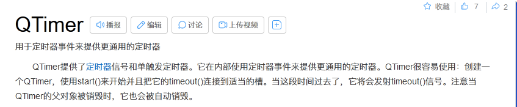

说白了QTimer就是一个定时器，到了设置的间隔就会发出一次信号，然后调用我们的槽函数。

`gameStart`和`gameOver`函数中`Timer`的启动和停止更加验证了我们的猜想。

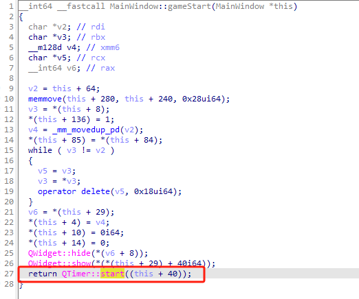

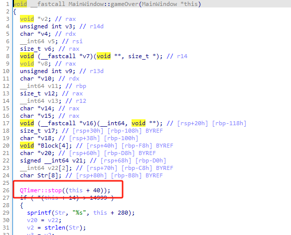

也就是说，每当游戏开始，每隔`20`毫秒`QTimer`就会调用一次槽函数。于是我们的重点就落到了研究槽函数。

槽函数一上来就进行了判断，这里的`14999`很可疑，因为游戏中要求我们坚持`15`秒，正好是`15000ms`，所以这个地方就是进行时间判断的。

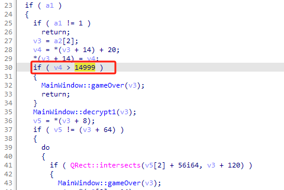

那么我们向上看，进行了一段赋值。这段赋值将`*(a2[2]+14)`增加`20`，正好符合我们的时间间隔，也说明的`*(a[2]+14)`就是我们当前时间的储存位置。

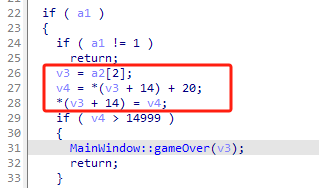

那么可以看出每`20`间隔就会调用一次`decrypt1`

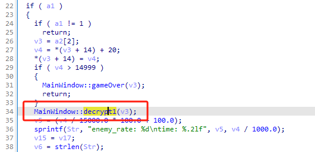

再向下看，可以看到一个dowhile，里面进行了一个判断，若成功则直接调用`gameOver`。这里的话其实不难猜是进行碰撞判定的，也就是判断玩家和敌人有没有相撞。`QRect::intersects`方法一查就知道是判断矩形有没有相交的。

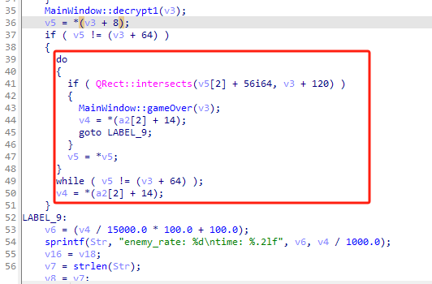

若我们成功躲避所有敌人，则不会进入分支。于是顺序执行到了`LABEL_9`中。其中有一个sprintf很醒目，这里就是生成游戏过程中右上角信息的地方，也验证了`v4`就是`time`。这里的`v6`是`enemy_rate`，是计算得到的，而且可以发现`enemy_rate`是随着时间变化逐渐变大的。

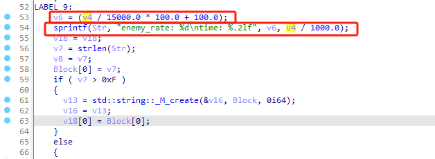

一路向下，没有看到`gameOver`的分支，直至`decrypt2`，这里进行了一个判断。这里判断的参数都是我们前面分析过的，一个是`*(a2[2]+14)`即时间，一个是`enemy_rate`。所以这里的逻辑就是当 `时间%(1s/enemy_rate)`时，即生成敌人的时刻，就会进行一次`decrypt2` 。下面调用的`addEnemy`证实了我们的猜想。

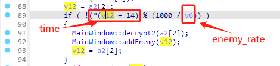

于是我们理清的所有的解密逻辑，现在就是要找到密文和密钥。

这里就选择`decrypt1`函数分析，`decrypt2`分析同理。

`v6`是第一块密文，循环最开始应该是`*(this+78)`，这里的指针类型为`_DWORD`，所以指向的应该是`*(this+78*4(byte))`。

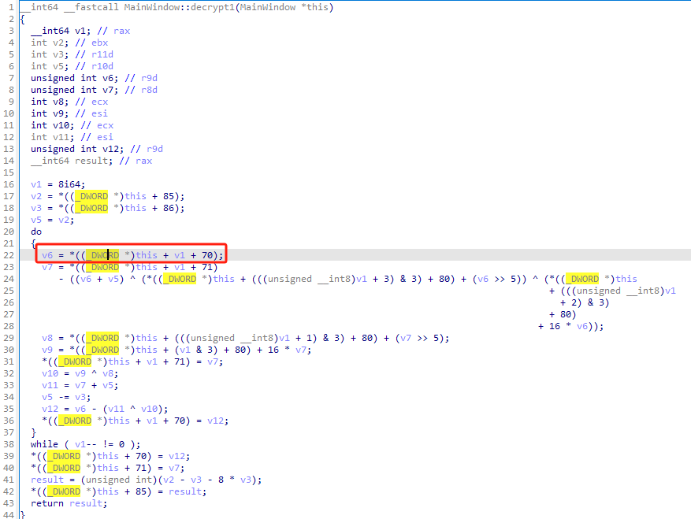

去到`gameStart`，由于指针类型为`_QWORD`即`8`字节大小，所以`*(this+39*8(byte))`=`*(this+34*8(byte))`

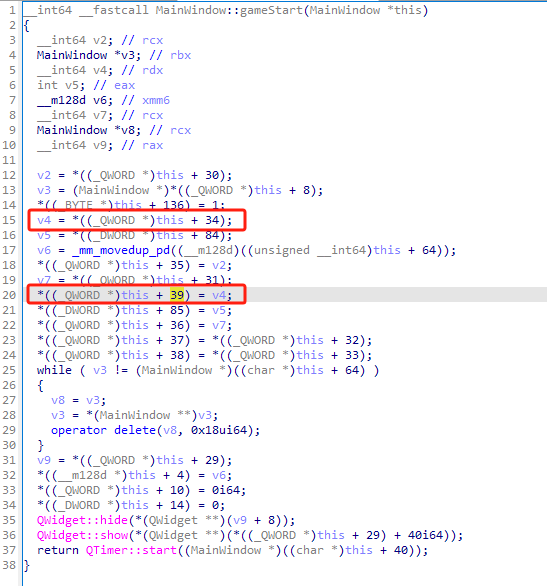

回到一开始的`MainWindow`构造函数

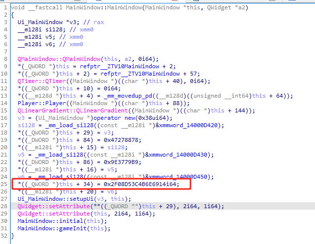

成功获得了密文，而且解密函数是向前推进的，所以这个是密文的结尾，这样一步步推，即可找出完整密文为

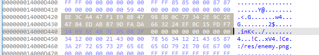

```c
8E 3C A4 47 F1 E9 8B 47  98 88 0C 77 34 2E 9C 2E
47 84 ED AB B7 9D FA DA  66 32 24 EF BC 15 FD F7
14 69 6E 4B 3C D5 08 2F  
```

delta为`0x9E3779B9`

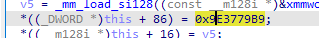

根据`delta`可以容易找到`sum`

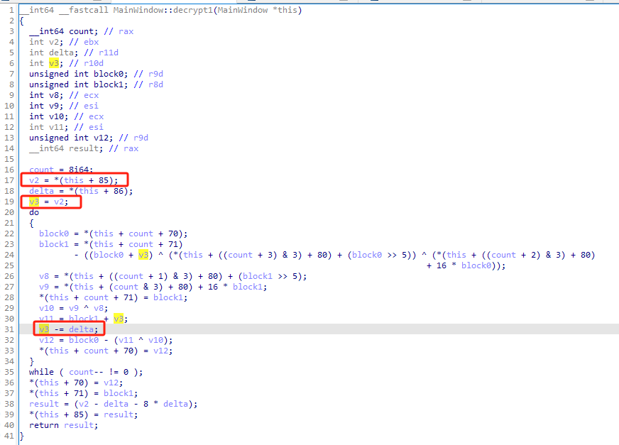

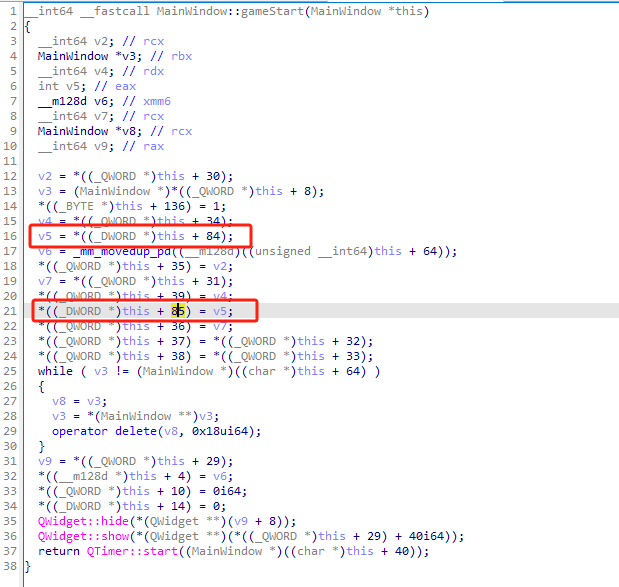

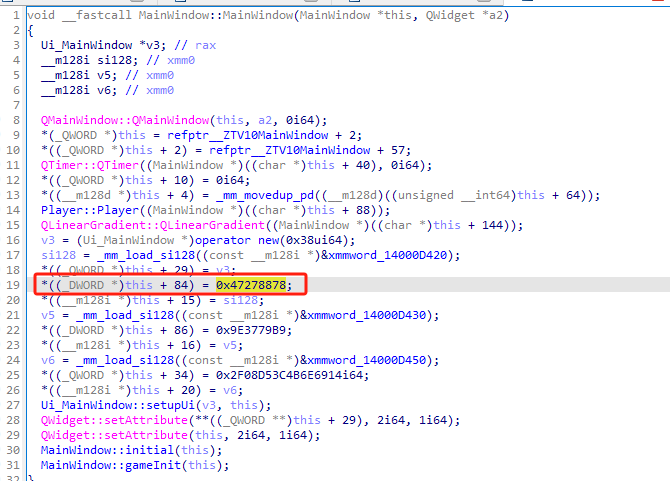

`sum`起始为`0x47278878`

慢慢逆可以得到`decrypt1`和`decrypt2`的逻辑为

```c++
void decrypt1(){
    for(int i=8;i>=0;i--){
        uint32_t v0 = flag[i], v1 = flag[i+1];
        v1 -= ((v0 << 4) + key[(i+2)%4]) ^ (v0 + tmp_sum) ^ ((v0 >> 5) + key[(i+3)%4]);
        v0 -= ((v1 << 4) + key[i%4]) ^ (v1 + tmp_sum) ^ ((v1 >> 5) + key[(i+1)%4]);
        tmp_sum -= delta;
        flag[i] = v0;
        flag[i+1] = v1;
    }
}

void decrypt2(){
    for(int i=8;i>=0;i--){
        uint32_t v0 = flag[i], v1 = flag[i+1];
        v1 -= (((v0 << 4) ^ (v0 >> 5)) + v0) ^ (tmp_sum + key[(tmp_sum >> 11) & 3]);
        v0 -= (((v1 << 4) ^ (v1 >> 5)) + v1) ^ (tmp_sum + key[tmp_sum & 3]);
        tmp_sum -= delta;
        flag[i] = v0;
        flag[i+1] = v1;
    }
}
```

拿到python里面跑一下
~~~
flag = [0x47a43c8e, 0x478be9f1, 0x770c8898, 0x2e9c2e34, 0xabed8447, 0xdafa9db7, 0xef243266, 0xf7fd15bc, 0x4b6e6914, 0x2f08d53c]
sum = 0x47278878
delta = 0x9e3779b9
key = [0x1234, 0x4321, 0x12345678, 0x87654321]


def tea_decrypt():
    global sum
    global delta
    global flag
    global key
    for i in range(8, -1, -1):
        v0 = flag[i]
        v1 = flag[i + 1]
        v1 -= ((v0 << 4) + key[(i + 2) % 4]) ^ (v0 + sum) ^ ((v0 >> 5) + key[(i + 3) % 4])
        v1 = v1 & 0xFFFFFFFF
        v0 -= ((v1 << 4) + key[i % 4]) ^ (v1 + sum) ^ ((v1 >> 5) + key[(i + 1) % 4])
        v0 = v0 & 0xFFFFFFFF
        sum -= delta
        sum = sum & 0xFFFFFFFF
        flag[i] = v0 & 0xFFFFFFFF
        flag[i + 1] = v1 & 0xFFFFFFFF


def xtea_decrypt():
    global sum
    global delta
    global flag
    global key
    for i in range(8, -1, -1):
        v0 = flag[i]
        v1 = flag[i + 1]
        v1 -= (((v0 << 4) ^ (v0 >> 5)) + v0) ^ (sum + key[(sum >> 11) & 3])
        v1 = v1 & 0xFFFFFFFF
        v0 -= (((v1 << 4) ^ (v1 >> 5)) + v1) ^ (sum + key[sum & 3])
        v0 = v0 & 0xFFFFFFFF
        sum -= delta
        sum = sum & 0xFFFFFFFF
        flag[i] = v0 & 0xFFFFFFFF
        flag[i + 1] = v1 & 0xFFFFFFFF


if __name__ == '__main__':

    GAME_MAX_TIME = 15000
    ENEMY_MAX_RATE = 200
    ENEMY_MIN_RATE = 100
    decstr = ''
    count = 0
    while True:
        count += 20
        if count == GAME_MAX_TIME:
            break
        tea_decrypt()
        enemy_rate = int(ENEMY_MIN_RATE + (ENEMY_MAX_RATE - ENEMY_MIN_RATE) * (count / GAME_MAX_TIME));
        if count % (1000 // enemy_rate) == 0:
            xtea_decrypt()
    flag_str=b''
    for i in flag:
        flag_str+=int.to_bytes(i,4,'little')
    print(flag_str)
~~~
得到flag
~~~
BUAACTF{Se7_7iMeR_In7ERV4l_F0R_My_G4Me}
~~~
